# Eventix
Project Portofolio Pengembangan Berbasis Teks (PBT), Aplikasi pesan tiket Dekstop dengan bahasa C# dan framework.net
(aplikasi ini masih belum 100% jadi jadi mungkin ada beberapa fitur yang kurang atau mengalami bug)

Fitur :
- buat event
- cari tiket
- enkripsi data pengguna
- filter tiket
- google maps
- User = User, Admin, Penyelenggara

Install :
- aplikasi ini belum jadi, jadi aplikasinya belum sampai tahap build

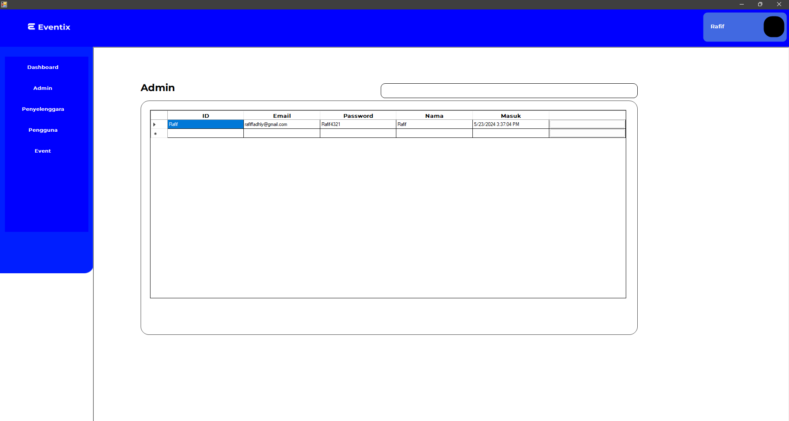
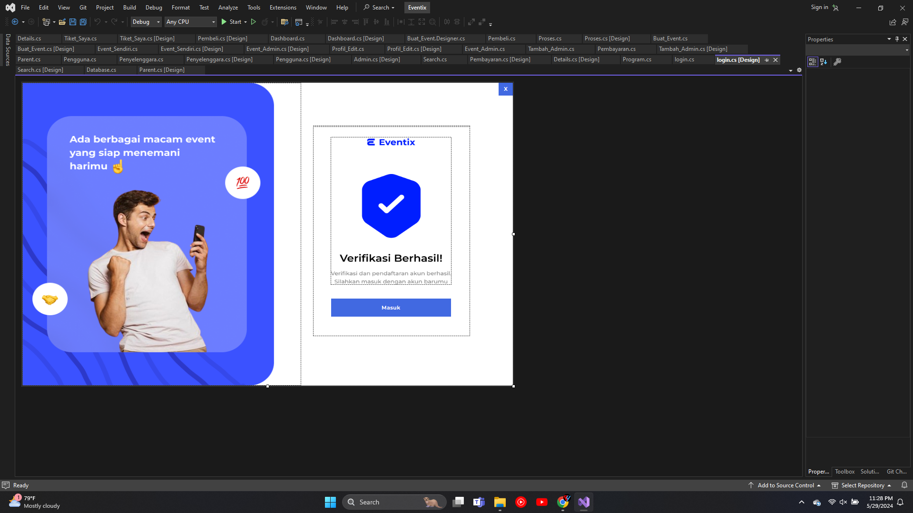
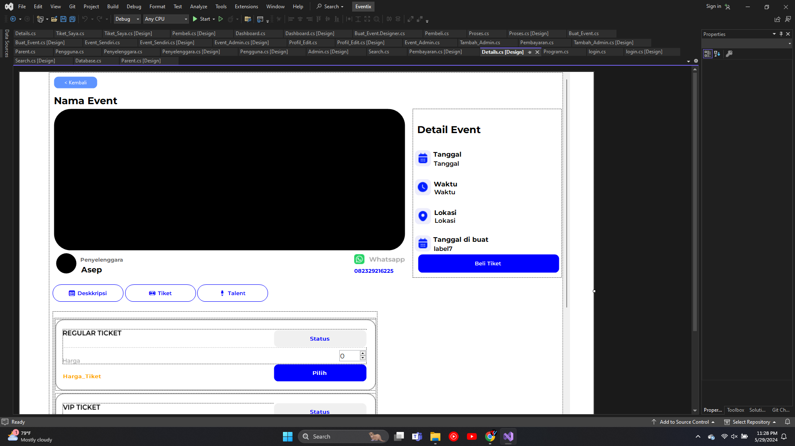
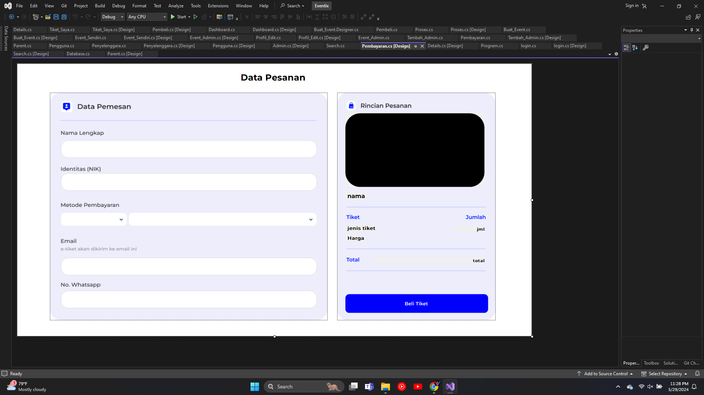
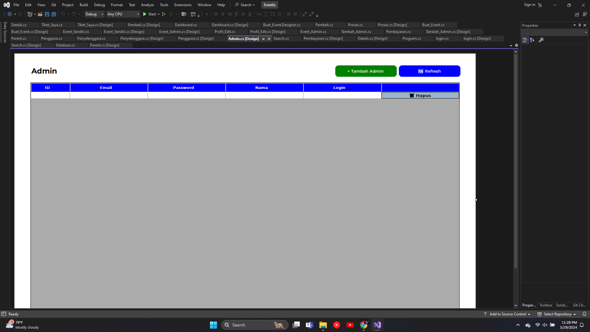
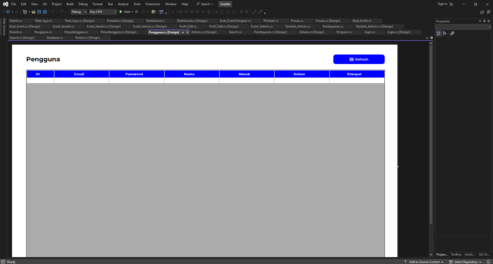
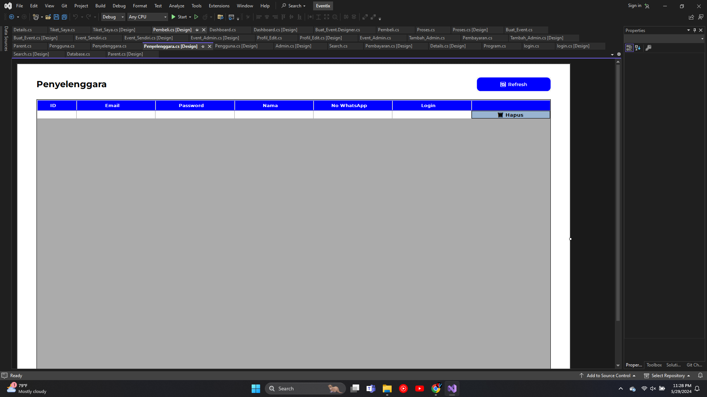
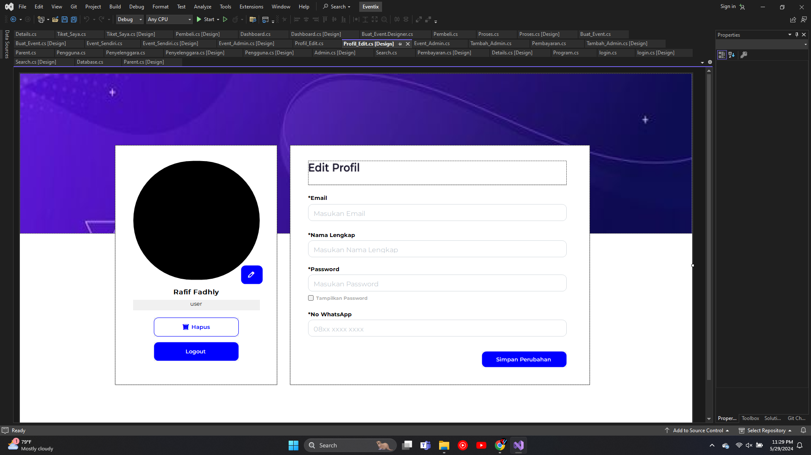
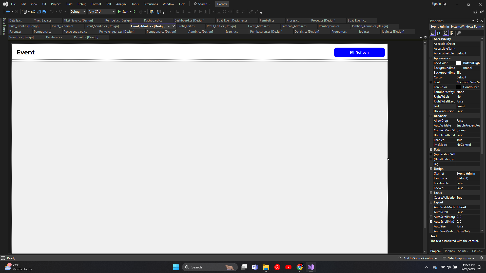
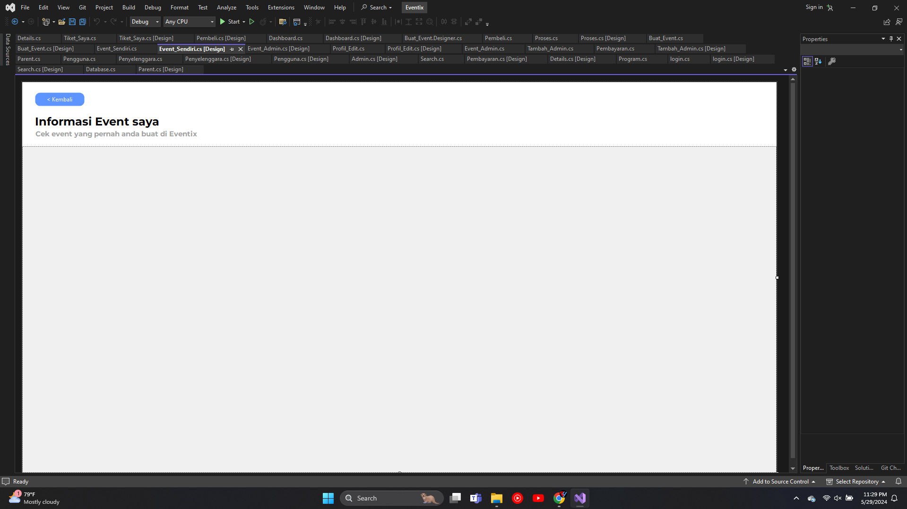
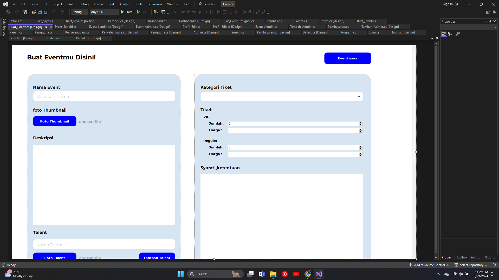
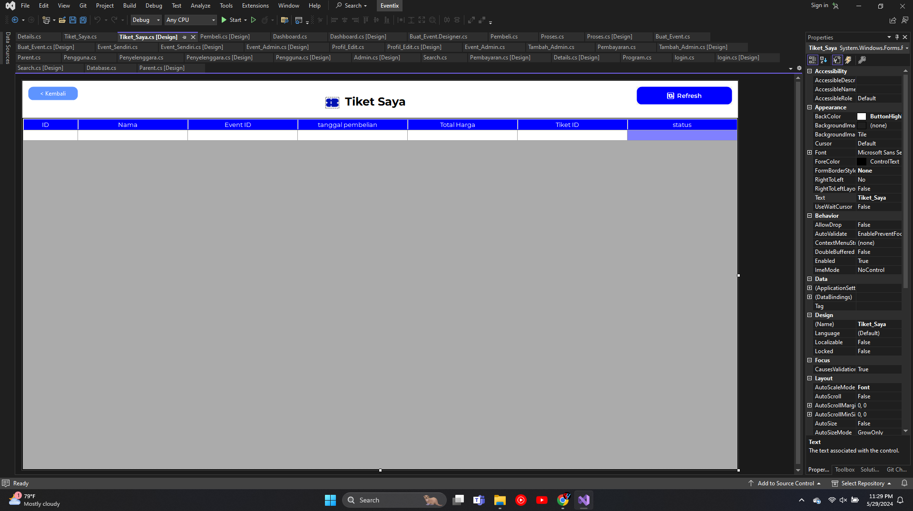
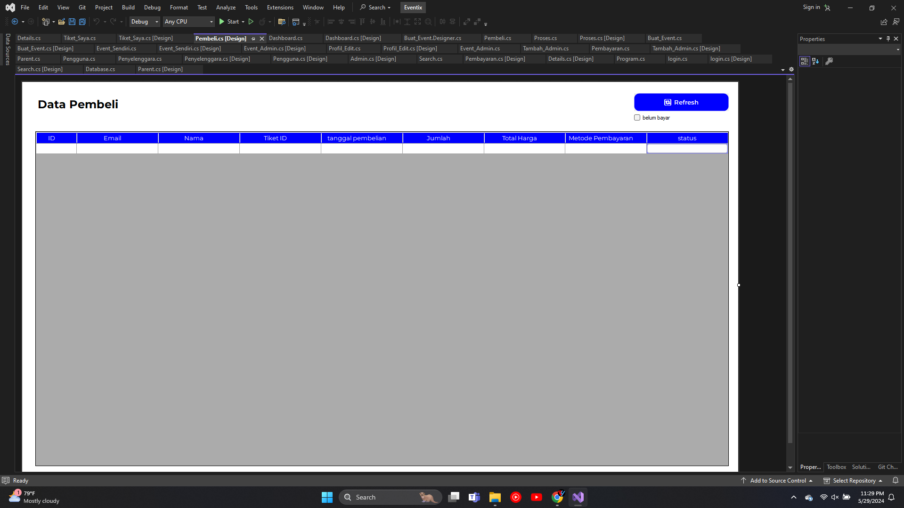

